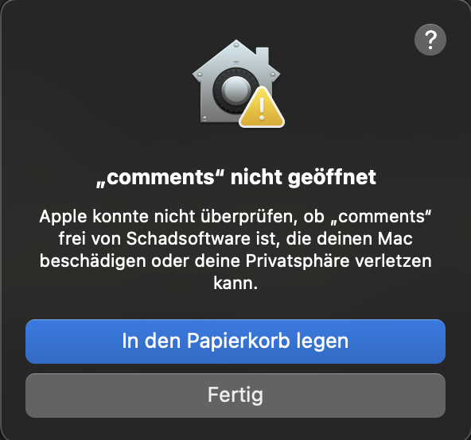

Die wichtigsten Environment-Variablen für `go run`:

## 🔧 **Minimale ENV-Variablen (lokal):**

```bash
# Minimal-Setup für lokale Entwicklung
export REDIS_ADDR=localhost:6379
export ADMIN_TOKEN=your-super-secret-admin-token-here

go run main.go
```

## 📋 **Vollständige ENV-Variablen:**

## 🚀 **Schnellstart-Kommandos:**

### **1. Absolutes Minimum:**

```bash
REDIS_ADDR=localhost:6379 ADMIN_TOKEN=test123 go run main.go
```

### **2. Empfohlenes Setup:**

```bash
export REDIS_ADDR=localhost:6379
export ADMIN_TOKEN=$(openssl rand -hex 32)
export AUTH_ENABLED=true
export STAGE=development

echo "Admin Token: $ADMIN_TOKEN"
go run main.go
```

### **3. Mit .env Datei:**

```bash
# Erstelle .env Datei:
cat > .env << EOF
REDIS_ADDR=localhost:6379
ADMIN_TOKEN=your-secret-token-here
AUTH_ENABLED=true
STAGE=development
PORT=8080
EOF

# Laden und starten:
set -a; source .env; set +a
go run main.go
```

## 📋 **Welche sind ERFORDERLICH:**

### ✅ **REQUIRED (Minimum):**

- `REDIS_ADDR` - Redis/ValKey Server Adresse
- `ADMIN_TOKEN` - Token für Admin-Endpunkte

### 🟡 **OPTIONAL (haben Defaults):**

- `REDIS_PASSWORD` - Default: “” (leer)
- `REDIS_DB` - Default: 0
- `PORT` - Default: 8080
- `AUTH_ENABLED` - Default: true
- `STAGE` - Default: development
- `VERSION` - Default: dev

## 🧪 **Test ob Redis läuft:**

```bash
redis-cli ping
# Sollte "PONG" zurückgeben
```

## Start mit binary

Auf der Release Seite die OS und Arch Version [herunterladen](https://github.com/ruedigerp/comments/releases/tag/nightly)  und entpacken. 

```bash
mkdir static/{assets,js,css} templates

curl -O templates/comment-widget.js.tmpl "https://raw.githubusercontent.com/ruedigerp/comments/refs/heads/main/templates/comment-widget.js.tmpl?token=GHSAT0AAAAAADEREZR44AVKGPQ7EAHKRIPA2CX2K3Q" 

```

MacOS Warnung beim Ausführen:



```bash
./comments
[1]    83559 killed     ./comments
```

Systemeinstellungen -> Datenschutz & Sicherheit: 


```
"comments" wurde blockiert, um deinen Mac zu schützen. 
```

Klick auf: "Trotzdem erlauben"

Beim nächsten Start auf "Erlauben" klicken, mit Password oder Fingerprint freigeben und Comments startet. 

```bash
#> ./comments
2025/06/22 10:42:41 🚀 Starting Comment API dev (development)
2025/06/22 10:42:41 📡 Connecting to Redis: localhost:6379
2025/06/22 10:42:41 ⚠️  ADMIN_TOKEN not set! Generated temporary token: d8f805f51ec195b2b08f09f81eb395dd1ea1f91b3bb4ddd6e56ac1619f7ea7be
2025/06/22 10:42:41 🔐 Set ADMIN_TOKEN environment variable for production!
2025/06/22 10:42:41 🔐 Authentication: true
2025/06/22 10:42:41 ✅ Redis connection successful
2025/06/22 10:42:41 ✅ Template-Datei gefunden: templates/comment-widget.js.tmpl
2025/06/22 10:42:41 ✅ Template-Validation erfolgreich: ./templates/comment-widget.js.tmpl
2025/06/22 10:42:41 🔥 Template Hot-Reload aktiviert (Development Mode)
🌐 Comment API dev running on port 8080
💚 Health Check Endpoints:
  GET    /health                  - Detailed Health Check
  GET    /health/live             - Liveness Check (K8s)
  GET    /health/ready            - Readiness Check (K8s)
  GET    /metrics                 - Application Metrics
📋 API Endpoints:
  GET    /                        - Simple Health Check
  POST   /api/comments            - Create Comment
  GET    /api/comments            - Get Comments
📁 Static Files:
  GET    /js/comment-widget.js    - Comment Widget
🔐 Admin:
  GET    /admin                   - Admin Panel
🔑 Admin Token: d8f805f51ec195b2b08f09f81eb395dd1ea1f91b3bb4ddd6e56ac1619f7ea7be
💡 Use: Authorization: Bearer <token> or X-Admin-Token: <token>
2025/06/22 10:42:41 📁 Template-Pfad: ./templates/comment-widget.js.tmpl
2025/06/22 10:42:41 🎯 Template-Modus: development
2025/06/22 10:42:43 🔄 Template-Datei geändert, Cache wird geleert...
2025/06/22 10:42:43 ✅ Template-Validation erfolgreich: ./templates/comment-widget.js.tmpl
2025/06/22 10:42:43 ✅ Template erfolgreich neu geladen
```

# Docker

# docker-compose

Die Docker docker-compose.yaml, Start-, Stop-, Test- und weitere Scripte sind unter [docker-compose](docker-compose/) abgelegt. 

